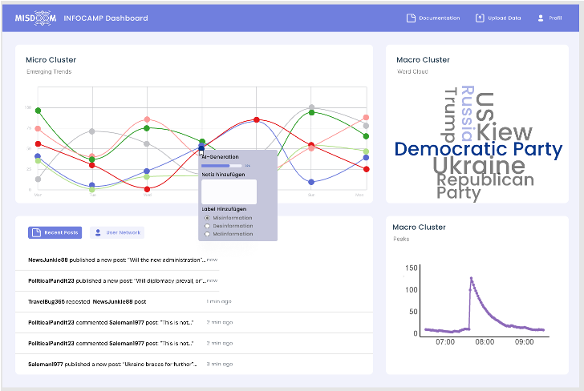

# INFOCAMP - Board



## Motivation
The presidential election in the United States is coming up and even before the campaign has really started, things are already in full swing online: Inauthentic, coordinated behaviour is eroding trust in (social) media, no matter what the topic, from the conflicts between Russia and Ukraine and Israel and Palestine, to elections at home and abroad. Too many opinions and too much information - and on top of that, it is becoming increasingly difficult to decide what is true and what is fake. And as if that wasn't enough, the immense progress of AI-driven language models such as ChatGPT means that the possibilities of using social bots for your own dark purposes are becoming ever more diverse. The project seminar is for those interested in technology and data science as well as those who want to deal with social issues. The aim is to create a hybrid dashboard for the real-time visualisation and analysis of (dis)information campaigns. Hybrid means a division into two phases: The real-time visualisation should include live tracking of posts that are automatically grouped by content, which enables the recognition of patterns that indicate coordination in posting behaviour. The analysis phase consists of a content analysis of identified clusters as well as a comparison of clusters over time, as these can indicate renewed coordination but also thematic changes in the respective context. 
There are no hard requirements, but there are a few signs that the project seminar is the right one for you: If you are interested in the social media cosmos, enjoy programming, especially with Python, want to design a conceptual and user-friendly dashboard, want to deal with the visual design of (web) applications or already have experience with Dash (really only by chance😉). Or you simply want to try out familiar approaches to data science and discover new ones. Then you've come to the right place!

# Run the Application locally
0. install all necessary packages: see the file 'necessary_packages.txt.'
1. you can use the requirements.txt with pip (for much quicker pip package installation)
```bash
pip install -r requirements.txt
```
2. adjust the user information in Microclustering/ssh_tunnel.py line 12 and line 13
3. run ```python manage.py runserver ``` or ```python3 manage.py runserver ``` depending on your environment
# Access via Django
- Username: admin
- Passwort: infocamp2024

# Content

- [Installation via GitHub](#Installation-via-GitHub)
- [Contribution](#Contribution)

## Installation via GitHub

To install INFOCAMP - Board, follow these steps:

1. Clone the repository:
```bash
git clone https://github.com/MattisSipp/infocamp.git
```
2. Switch to your branch:
```bash
git checkout your-branch-name
```

## Contribution

To contribute, follow these guidelines:

1. Create a new branch for your feature or bug fix:
- For feature branches: `feature/your-feature-name`
- For bugfix branches: `bugfix/your-bugfix-name`

2. Implement your changes and ensure all tests pass.

3. Push your branch to the repository:
```bash
git push origin your-branch-name
```
4. Submit a pull request targeting the `main` branch.

Only admins have permission to push to the `master` branch to ensure stability and reliability of the main branch.

# Info for Developers 


