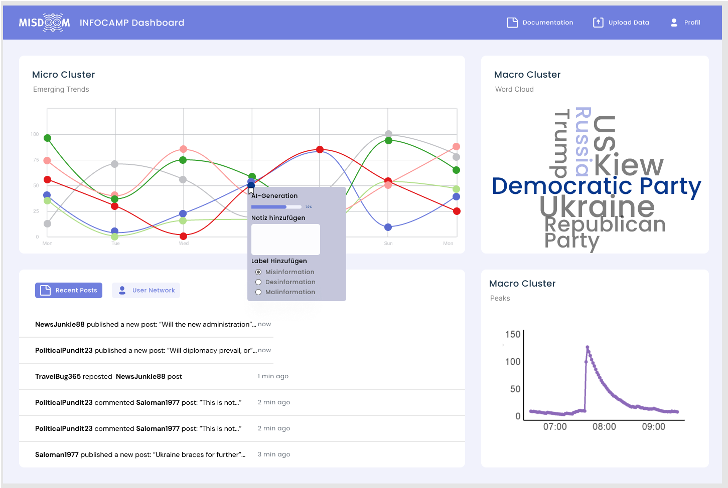

# INFOCAMP - Board



Die Präsidentschaftswahl in den Staaten steht an und noch bevor der Wahlkampf richtig begonnen hat, geht es online bereits in die Vollen: Unauthentisches, koordiniertes Verhalten erodiert das Vertrauen in (soziale) Medien, egal um welche Themen es geht, von den Konflikten zwischen Russland und der Ukraine sowie Israel und Palästina, bis zu den Wahlen im In- und Ausland. Zu viele Meinungen und Informationen - und obendrein wird es immer schwieriger zu entscheiden, was wahr und fake ist. Und als wäre das nicht genug, werden durch den immensen Fortschritt KI-getriebener Sprachmodelle wie ChatGPT die Möglichkeiten Social Bots für die eigenen, dunklen Zwecke zu verwenden, immer vielfältiger. 
Das Projektseminar ist für Technik- und Data Science-Affine sowie diejenigen, die sich mit gesellschaftlichen Themen auseinandersetzen wollen zugleich. Ziel ist die Erstellung eines hybriden Dashboards für die Echtzeitvisualisierung und Analyse von (Des)Informationskampagnen. Hybrid bedeutet eine Aufteilung in zwei Phasen: Die Echtzeitvisualisierung soll ein Live-tracking von inhaltlich automatisch gruppierten Posts beinhalten, die eine Erkennung von Mustern, die auf Koordination im Postingverhalten hinweisen, ermöglicht. Die Analysephase besteht aus einer inhaltlichen Analyse von identifizierten Clustern sowie einem Vergleich von Clustern über Zeit, da diese auf erneute Koordination aber auch auf thematische Wechsel im jeweiligen Kontext hinweisen können. 
Harte Anforderungen gibt es keine, aber ein paar Anzeichen dafür, dass das Projektseminar das richtige für Dich ist: Wenn Du Interesse am Social Media Kosmos, Spaß am Programmieren insbesondere mit Python hast, Du ein Dashboard konzeptuell und nutzerfreundlich gestalten möchtest, Dich mit dem visuellen Design von (Web)applikationen auseinandersetzen willst oder schon Erfahrung mit Dash hast (wirklich nur zufällig😉). Oder Du hast einfach Lust, gelernte Ansätze zur Data Science auszuprobieren und neue zu entdecken. Dann bist du hier richtig!

# Zugangsdaten via Django
- Username: admin
- Passwort: infocamp2024

# Content

- [Installation via GitHub](#Installation-via-GitHub)
- [Contribution](#Contribution)

## Installation via GitHub

To install INFOCAMP - Board, follow these steps:

1. Clone the repository:
```bash
git clone https://github.com/MattisSipp/infocamp.git
```
2. Switch to the specific branch:
```bash
git checkout branch_name
```

## Contribution

To contribute, follow these guidelines:

1. Create a new branch for your feature or bug fix:
- For feature branches: `feature/your-feature-name`
- For bugfix branches: `bugfix/your-bugfix-name`

2. Implement your changes and ensure all tests pass.

3. Push your branch to the repository:
```bash
git push origin your-branch-name
```
4. Submit a pull request targeting the `dev` branch.

Only admins have permission to push to the `master` branch to ensure stability and reliability of the main branch.


