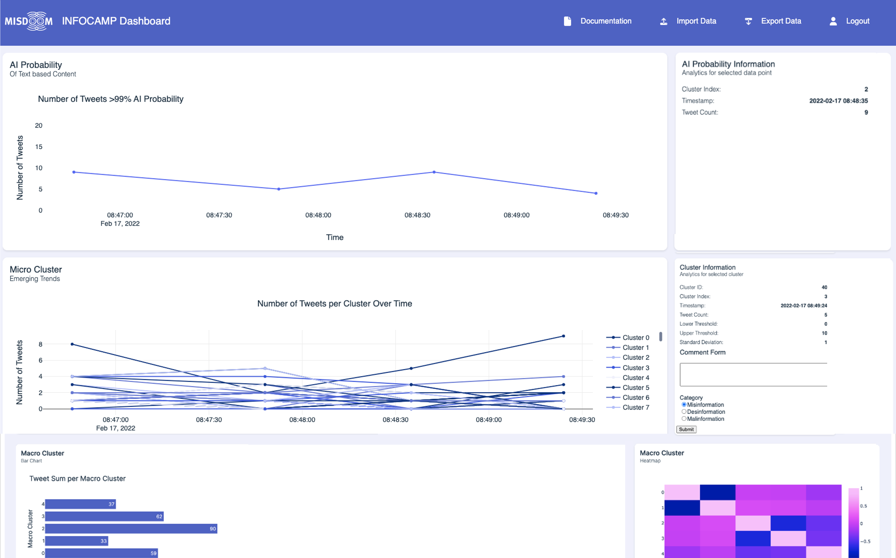

# INFOCAMP - Board



## Motivation
Social media platforms are becoming the dominant source of information for a significant proportion of the global population. With the deliberate dissemination of false and harmful information, it is crucial that individuals are made aware and that public discourse in online media can continue without malicious intent. We are therefore developing a dashboard to visualize disinformation campaigns in social media posts in real time, utilizing emerging technologies such as word embedding methods like Word2vec and stream clustering. The dashboard will allow users to upload their own social media data and analyse it for anomalies in the activity patterns of related users. Furthermore, it will enable the integration of the probability of AI-generated content to detect disinformation campaigns. Our goal is to aid e.g. computational social scientists to detect and combat disinformation in online media.

## Installation
The dashboard runs via a private server of the University of Muenster. This means that additional authentication must be carried out at the University of Muenster. After that you can run the application locally.
You have to be part of the University of Muenster and have an account at the University in order to use the Dashboard.

### Connecting to Server
1. Create SSH-Key locally
2. Store the SSH-Key in the IT portal of the University of Muenster (https://it-portal.uni-muenster.de/index.php)

### Run the Dashboard locally
1. Clone the repository:
```bash
git clone https://github.com/MattisSipp/infocamp.git
```
2. Log in via your user name and personal access token
3. Change your working directory to the location of the cloned repository
4. In the file Microclustering/ssh_tunnel.py change lines 12 & 13 to your personal information:
```bash
ssh_user = # 'uni-id'
ssh_private_key = # 'path of your SSH-Key'
```
5. install all necessary packages: see the file 'necessary_packages.txt.'
You can use the requirements.txt with pip (for much quicker pip package installation)
```bash
pip install -r requirements.txt
```
6. Install textclust (v0.0.2) using this documentation: https://textclustpy.readthedocs.io/en/latest/ (github repo: https://github.com/Dennis1989/textClustPy)
7. Connect with the VPN of the University of Muenster (You must be in the network environment of the Uni in order to use the AI detector)
8. Run ```python manage.py runserver``` or ```python3 manage.py runserver``` depending on your environment
9. Open link ```http://127.0.0.1:8000/``` in any browser to open the Dashboard
10. Register or log in
11. Upload a data set (.csv or json)
12. Play around and analyze some data!

## Short explanation of different widgets
**AI Probability Graph:** This graph tracks the number of tweets likely generated by AI over time. We utilize an AI detector developed by Christian Grimme, which analyzes each tweet to determine the likelihood of it being AI-generated. The graph includes all tweets with a probability of over 99% of being AI-generated. By clicking on the peaks in the graph, the widget on the right will display recent posts. Our goal is to identify peaks in AI-generated tweets to observe patterns in timing and content within this group.

**Micro Cluster Graph:** This graph helps identify peaks in specific trending topics. It shows how different topics trend and evolve over time. By clicking on a peak, users can label the cluster for further review later.

**Macro Cluster Graph:** Macro Clusters are derived from Micro Clusters and represent the most discussed topics. A heat map visualizes the differences and similarities between these Macro Clusters.

## Contribution

- [Installation via GitHub](#Installation-via-GitHub)
- [Contribution](#Contribution)

### Installation via GitHub

To install INFOCAMP - Board, follow these steps:

1. Clone the repository:
```bash
git clone https://github.com/MattisSipp/infocamp.git
```
2. Switch to your branch:
```bash
git checkout your-branch-name
```

### Contribute to the Dashboard

To contribute, follow these guidelines:

1. Create a new branch for your feature or bug fix:
- For feature branches: `feature/your-feature-name`
- For bugfix branches: `bugfix/your-bugfix-name`

2. Implement your changes and ensure all tests pass.

3. Push your branch to the repository:
```bash
git push origin your-branch-name
```
4. Submit a pull request targeting the `main` branch.

Only admins have permission to push to the `master` branch to ensure stability and reliability of the main branch.

## Further exciting things to do with the Dashboard
We were able to create a first running application of the dashboard and have a couple of analyses. If you like our approach and want to enhance the dashboard even further, we listed some possible next steps:
1. Run the dashboard on a public server so that anyone (with proper authentification) can access the dashboard and must not be a part of the University of Muenster
2. Implement user roles and extend the data base. With that several people with different data can work with the dashboard simultaneously.  


